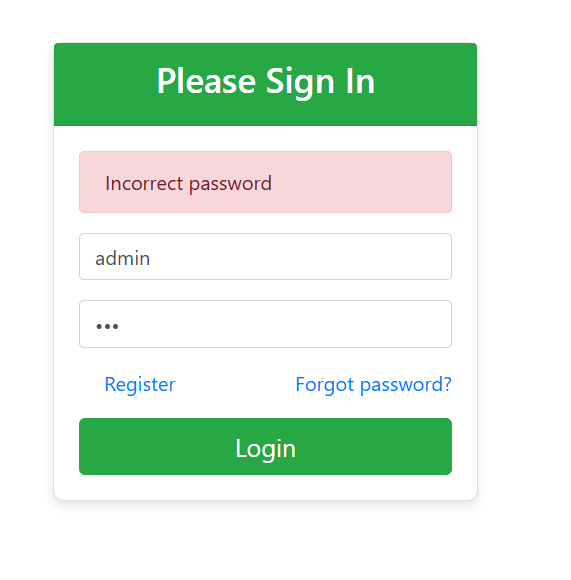
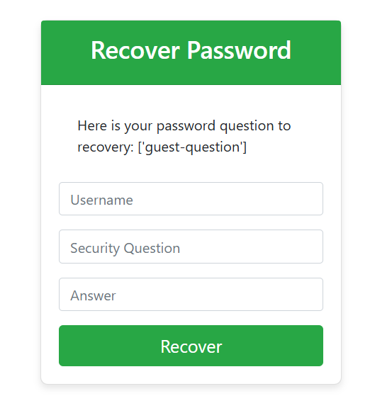
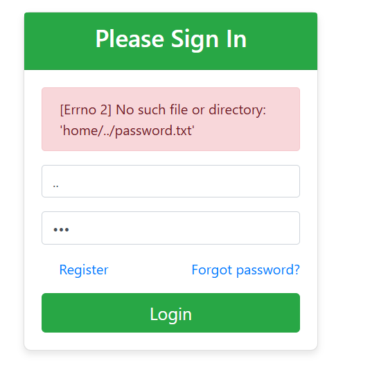
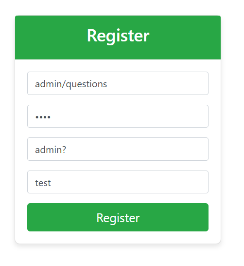
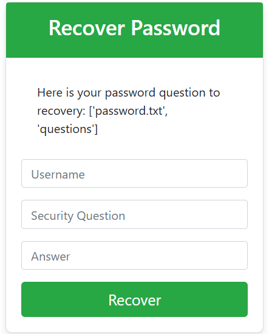
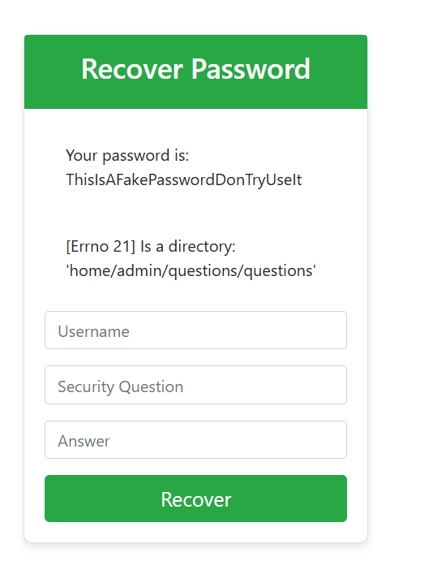
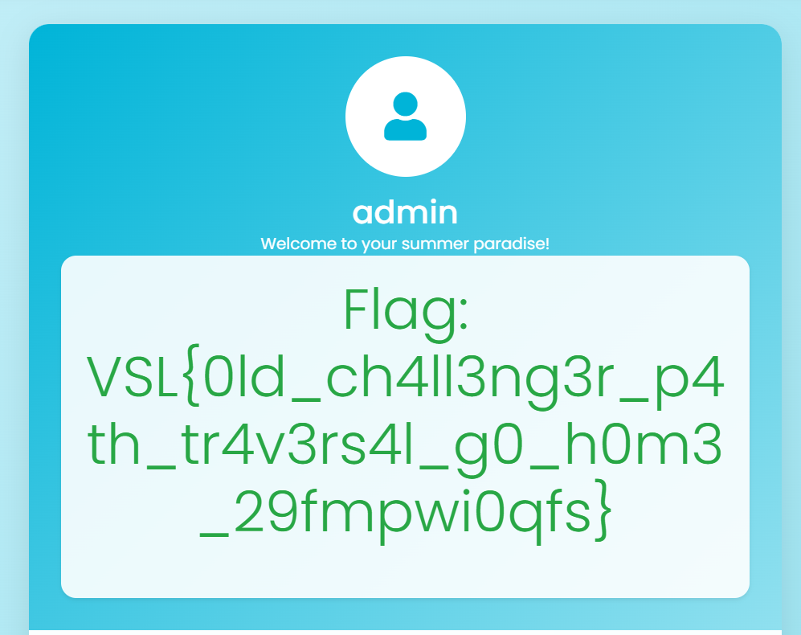

# VSL Summer CTF

---
# Challenge: Beach Shop - Old Challenge
---
## 1. Thông tin người thực hiện
- Họ và tên: Lê Ngọc Thuận

## 2. Thông tin Challenge:
- Link: http://61.14.233.78:1002
- Tính năng: Cho phép người dùng tạo tài khoản, đăng nhập, reset mật khẩu.

## 3. Solution:

- Mô tả thử thách:

<pre>Nếu bạn thấy nó quen thuộc thì bạn thực sự là một hacker lâu năm của VSL đấy :3
Chúc may mắn nhé! (Tài khoản test: guest/guest)</pre>

- Từ mô tả trên, mình nghĩ đây cũng có thể là 1 lời gợi ý:
	+ Đây là 1 challenge cũ, vậy rất có thể mã nguồn đã được tác giả lưu trữ ở đâu đó trên Internet và sau khi recon thì mình tìm đã tìm được mã nguồn của trang web.
    + Suy nghĩ vậy thôi chứ mình đã giải black box trước khi tìm ra được mã nguồn. Mình đã khá may mắn khi tìm được nó, như vậy thì mình có thể viết write up dễ dàng hơn :))
    + link mã nguồn: https://github.com/VKU-Security-Lab/CTF-VSL-Internal-2025/tree/main/Web/userhome

- Vì server của thử thách có vẻ không có tính năng reset (vẫn để payload cũ của mình) và không còn phù hợp để mình có thể viết 1 write up, vì thể mình sẽ build lại challenge (source code cũ) với docker :))

- Ta sẽ truy cập: http://localhost:1002, giao diện có vẻ khác nhưng tính năng thì vẫn như thế

3.1. Xác định mục tiêu của thử thách:

- Mình thử truy cập với username là `admin` và một password bất kì là `123` thì nhận phản hồi `Incorrect password`. Vậy có thể đoán ta cần login với account của admin để giải được challenge.

3.2. Xác định lỗ hổng bảo mật:
- Tại endpoint: `/forgot` ta thử nhập username `admin` và server trả về một cảnh báo lỗi: `[Errno 2] No such file or directory: 'home/admin/questions'` khá kì lạ, rất có thể server đang dính lỗi **Path Traversal**.
- Tiếp tục thử test với username: `guest` nhưng lần này ta sẽ truyền vào `../home/guest` và ta thấy server vẫn trả về `password question` của account `guest` tại endpoint `/recover`. Từ đây ta có thể kết luận trang web dính lỗi **Path Traversal** cho phép ta thao túng đường dẫn tệp tin.

3.3. Khai thác
- Ta thử nhập username là `..` tại endpoint `/login` để xem trang web trả về cảnh báo lỗi gì. 

- `[Errno 2] No such file or directory: 'home/../password.txt'` từ đây ta có thể đoán server sẽ nhận username của người dùng sau đó mở file path `/home/<username>/password.txt` để lấy nội dung file `password.txt` so với password mà người dùng nhập vào để xác thực.

- Ta có thể đoán file `password.txt` được ghi vào khi người dùng đăng ký account. Vậy sẽ ra sao nếu ta có thể ghi 1 password do ta kiểm soát với user của `admin`. 

- Ta sẽ thử đăng ký tài khoản `admin` tại endpoint `/register` nhưng chắc chắn sẽ không được vì như ta đã biết user `admin` đã tồn tại.

- Quay lại endpoint `/forgot` khi ta nhập `admin` thì ta nhận cảnh báo lỗi `[Errno 2] No such file or directory: 'home/admin/questions'`, có vẻ như account `admin` không có câu hỏi bảo mật. Vậy sao ta không thử đăng ký với username là `admin/quetions` tại endpoint `/register`.
	+ username: `admin/questions`
    + password: `hehe`
    + security question: `admin?`
    + answer: `test`
    

- Như ta đã phân tích tại endpoint `/login`, người dùng có thể ghi vào file `password.txt` khi đăng ký tài khoản. Vậy khi ta đăng ký username `admin/questions` và password `hehe` thì nó sẽ ghi `hehe` vào file path `/home/admin/quetions/password.txt`.

- Quay lại endpoint `/forgot` và nhập username `admin` ta nhận được phản hồi:

- Ta có thể thấy file `password.txt` và `questions` được hiển thị tại endpoint `/recover`, từ đây ta có thể đoán trang web đã được code để liệt kê các file, thư mục từ đường dẫn `/home/admin/questions`.

- Vậy từ tất cả các dữ kiện trên ta đã phân tích, ta sẽ nhập thông tin vào endpoint hiện tại là `/recover` để có thể lấy được password của account `admin`:
	+ username: `admin`
    + security question: `password.txt`
    + answer: `hehe`
    

- Ta nhận được password `admin` là: `ThisIsAFakePasswordDonTryUseIt`
- Quay lại phần login của server thật: http://61.14.233.78:1002/login, rồi nhập username `admin` và password `ThisIsAFakePasswordDonTryUseIt`.
- Ta nhận được flag: `VSL{0ld_ch4ll3ng3r_p4th_tr4v3rs4l_g0_h0m3_29fmpwi0qfs}`

    