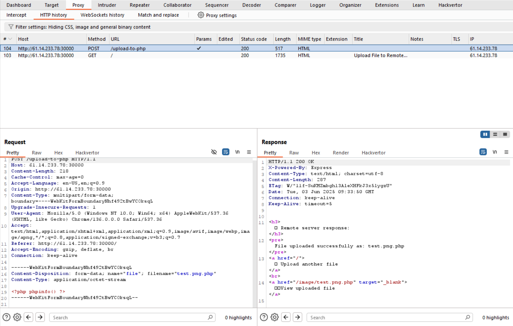
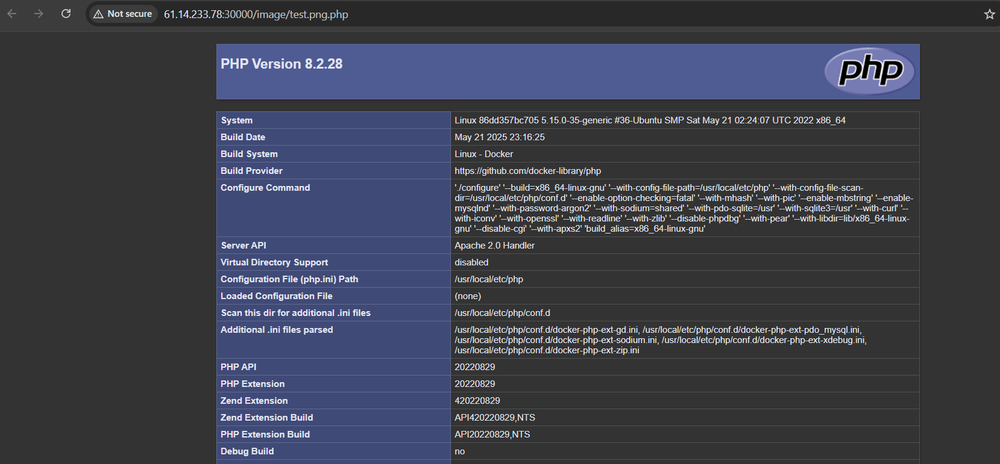
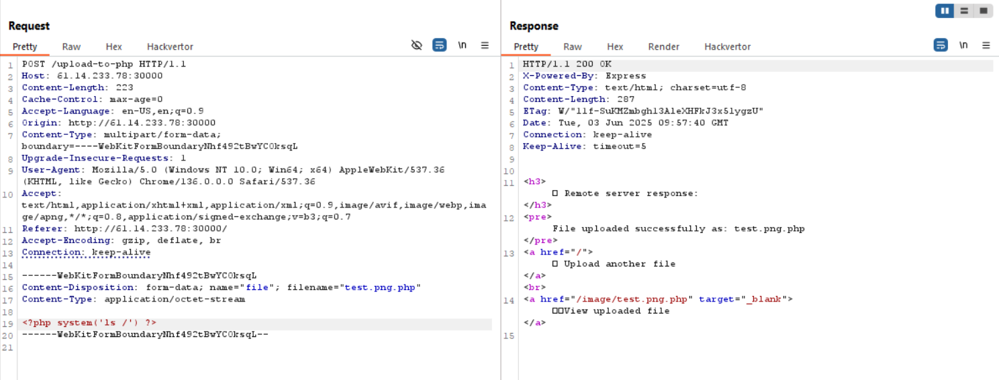
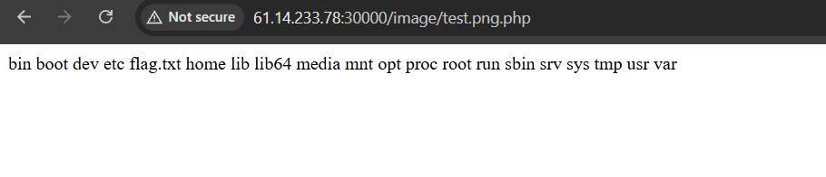
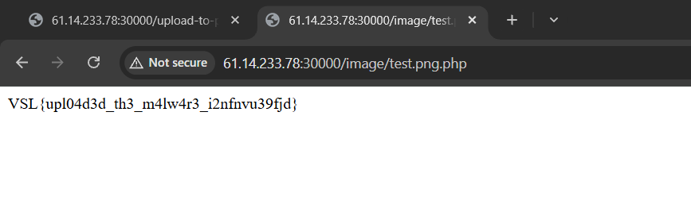

# VSL Summer CTF


---
# Challenge: Upload file 1
---
## 1. Thông tin người thực hiện
- Họ và tên: Lê Ngọc Thuận

## 2. Thông tin challenge
- Link: http://61.14.233.78:30000
- Tính năng: Trang web cho phép người dùng upload file lên server.

## 3. Lỗ hổng
### Upload file to RCE

**Description And Impact**
- Tại http://61.14.233.78:30000, trang cho phép người dùng có thể upload file lên server và lưu vào thư mục `/image/`.
- Tuy nhiên, trang web lại không xử lý chặt chẽ việc upload các file có extension độc hại. File độc hại này sẽ được lưu lại và có thể truy cập trực tiếp qua đường dẫn công khai, dẫn đến **RCE(Remote Code Execution)**.

**Root Cause Analysis**
- Lỗ hỗng này xuất phát từ việc chỉ kiểm tra 1 phần extension của file mà không kiểm tra extension cuối cùng và kẻ tấn công có thể upload các file có hai extension như `.png.php` để có thể RCE do cấu hình mặc định của Apache cho phép thực thi file có extension cuối cùng là `.php`.
- Code bị lỗi ví dụ cho việc xử lý file không an toàn trên:
```php
        $filename = $_FILES["file"]["name"];
        $extension = explode(".", $filename)[1];
        if ($extension === "php") {
            die("php extension is not allowed");
        }
```
- Hàm `explode(".", $filename)[1]` tách các phần của tên file dựa vào `.` và sau đó lấy phần extension sau tên file, ví dụ: file.png thì `$extension = "png"`.
- Tận dụng đoạn code lỗi `$extension = explode(".", $filename)[1];` này, kẻ tấn công upload file có tên `test.png.php` và vượt qua được lớp filter `if ($extension === "php")`.

**Solution**
1. Upload file `test.png.php` với công cụ burpsuite:
- Link download burpsuite: **https://portswigger.net/burp/communitydownload**
- Nhập url `http://61.14.233.78:30000` vào browser của burpsuite:
- Upload 1 tệp tin có tên `test.png.php` và có nội dung:
```php
<?php phpinfo() ?>
```
2. Quan sát gói tin với method `POST` mà burpsuite bắt được và gửi qua tab 	`Repeater` `(Ctrl + R)` để bước sau ta có thể điều chỉnh nội dung của gói tin:



- Ở phần `response` ta thấy server đã chấp nhận file `test.png.php` mà ta đã tải lên.
- Bây giờ, ta sẽ thử truy cập vào đường dẫn chứa file ta đã tải lên http://61.14.233.78:30000/image/test.png.php.



- Ta thấy file `test.png.php` đã được server thực thi và hiển thị nội dung của 
hàm `phpinfo()`.

3. Điều chỉnh nội dung gói tin đã gửi qua tab `Repeater` ở bước 2 và đọc nội dung của flag:
- Ta sửa hàm `phpinfo()` thành `system('ls /')` sau đó ấn `Send` để gửi gói tin đến server.



- Truy cập lại đường dẫn http://61.14.233.78:30000/image/test.png.php.



- Từ hình trên, ta thấy các file của thư mục `/` đã hiện thị và có chứa file flag.txt.

- Ta lại tiếp tục chỉnh sửa hàm trong gói tin để đọc nội dung flag.txt. Ở tab `Repeater` đổi `system('ls /')` thành `system('cat /flag.txt')` sau đó ấn `Send`. Cuối cùng truy cập lại đường dẫn http://61.14.233.78:30000/image/test.png.php và nhận được flag là `VSL{upl04d3d_th3_m4lw4r3_i2nfnvu39fjd}` 




